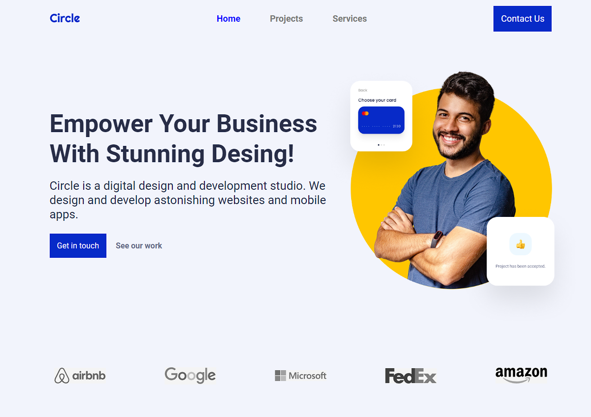

 

 
    
    <h3 align="center">Ironhack circle project</h3>
    

        <a href="https://ironhack-midtermproject.netlify.app">View Netlify deployed demo</a>
        ·
        <a href="https://raw.githubusercontent.com/ironhack-jc/mid-term-api/main/projects">View the API endpoint</a>
        .
        <a href="https://docs.google.com/presentation/d/1OmKw9Z9E9VzNTjuxRSztz58qTPYCYeLlFkYrvAVfnoo/edit?usp=sharing">Presentation - Google Presentation </a>
    

 

# Ironhack circle Project

Ironhack Frontend assignment project. The objective is to build and deploy a fictitious fully responsive Circle company website using technologies such as: HTML, CSS & JavaScript. Includes data fetching from an external Web API.

## About the project

Frontend Development of a website for a fictional Circle web design company, with responsive.

### Authors

|                     | Name                | GitHub              |
| :------------------ | :------------------ | :------------------ |
|  | **Mauricio** |  ***CruzMauSerrano*** |

### Objectives

- Creation of several pages:
  - a home page,
  - a “project” page 
  - a contact page with a form.
- Add navigation between pages.
- Make all contact form fields required before you can submit it.
-(Bonus) Add animations to different sections, such as “recent projects” cards
- Get the first three API projects (https://raw.githubusercontent.com/ironhack-jc/mid-term-api/main/projects). This API returns projects in descending order, so the first element of the array is the last project.
- Validate the form using JavaScript. Show an alert if the name is the same as ironhack: "You can't be Ironhack, because I am Ironhack." Additionally, more filters can be added: incorrect email, required fields not configured, etc.
- BONUS: Create an interactive menu. Clicking toggles the menu on or off.
- BONUS: Choose three other projects at random. If the project does not exist in the API, you must notify the user.

### Project assets

For this project, we had access to the following assets:
- A [Google drive] (https://drive.google.com/drive/folders/1s48zMkVPVFViY2Go1H6_4prQ3sAS--FV) where we activate everything necessary to start the project

- Then we upload the file [figma](https://www.figma.com/design/CChRJFRVb0PP1fd143qoAp/mid-term-project?node-id=29-110&t=AaljQZRxeeIkoeu6-0) to start designing the website

### Features

This project includes the following functionalities:

- Responsive web dessign
- Burger menu
- JavaScript Fetch API & dynamic pages generation
- Scroll to top button in the home page
- 404 Not Found error page
- CSS animations for the Scroll to top and the 404 error page
- Form validation
- Modal vanilla js window to show messages
- Favicon
### Web

- <a href="https://circle-project-mau.netlify.app/" target="_blank">Cicle Project</a>

### finished project

### Built With

- <a href="https://code.visualstudio.com/" target="_blank">Visual Studio Code</a>
- <a href="https://developer.mozilla.org/es/docs/Glossary/HTML5" target="_blank">HTML5</a>
- <a href="https://developer.mozilla.org/es/docs/Web/CSS" target="_blank">CSS3</a>
- <a href="https://developer.mozilla.org/es/docs/Web/JavaScript" target="_blank">JavaScript - [ECMAScript 2021]</a>
- <a href="https://fontawesome.com/" target="_blank">Font Awesome</a>
